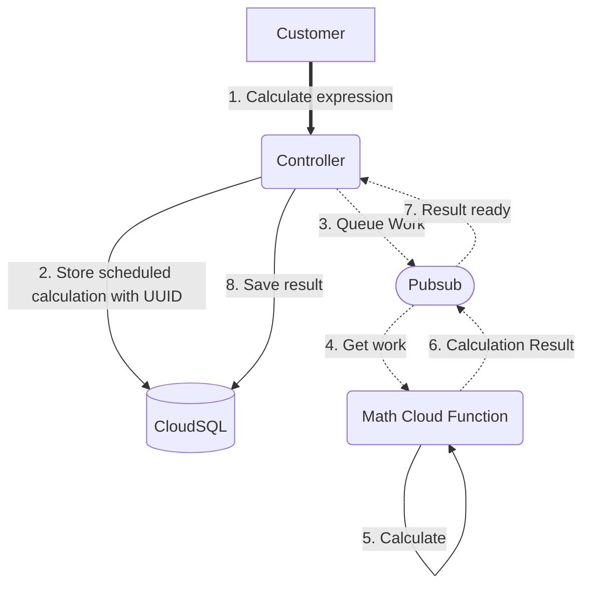

# otel-demo

This is a demo application that implements an asynchronous calculator. It consts of a "controller" microservice that
handles connect-go (gRPC) requests and a "worker" microservice that is implemented as a google cloud function. 
The controller microservice schedules work to the worker microservice via google Pubsub. 
The worker microservice receives a calculation request via pubsub, performs the calculation and returns the response back to the controller via pubsub.
The controller them stores the result to a Cloud SQL postgres database.

This demo shows how to use OpenTelemetry in a Go application that is running on GCP. It demonstrates the usage of middleware
to seamlessly propagate context across services and how to use the OpenTelemetry SDK to create custom spans. 
It implements a middleware for google Pubsub that transfers the trace context in the message metadata.

## Slides
You can find the slides for this talk [here](https://docs.google.com/presentation/d/1r1AoSwEDILcf0HmY7jRP9C0ghW33Z7Vs/edit?usp=sharing&ouid=108894967989365154526&rtpof=true&sd=true)

## Architecture

## Implementation Details
1. RPC requests are recieved by the __controller__ microservice using the __connect protocol__.
   - It implements the `Calculate` and the `List` methods.
2. The controller stores the request in postgres using Gorm package
3. The controller scheduled calculation using the Pubsub library.
4. The __math__ worker is implemented as a GCP Cloud Function. It receives the calculation request via Pubsub and returns the result via Pubsub.
5. The controller receives the result via Pubsub and stores it in postgres.